# Black Jacksonville Collective and Front Porch History Archive

The Front Porch History Archive is a collection of oral histories of individuals who contributed to the uplift of their community. This project archives the stories of residents from Black neighborhoods in Jacksonville that have been razed or gentrified in the name of urban revitalization. Sugar Hill, LaVilla, Durkeeville, and Cosmo were once thriving African American communities that sharply declined after Jacksonville consolidated them into its city limits. Collecting their taxes, but refusing to provide services, the city would eventually build interstates through the neighborhoods or simply demolish historic buildings, leaving behind empty lots.

This archive models African American Community Archives Theory as its framework by asking for stories from the community, centering the story of the community with each person we interview, and sharing the stories in an exhibit at a community museum. We research the person and the city’s history so we understand how that person’s story fits into the overall context of African American life in Jacksonville.

Our team consists of an historian, a community activist and interviewer, an artist, a director, and a community organizer to make the stories as engaging as possible, utilizing art and narrative with social media to make the stories as accessible as possible. The goal of our team is to share these stories with honesty, integrity, and respect, so that audiences can see the truth that not only does Jacksonville have an incredible legacy, but that our stories are what make communities great.

# About the Black Jacksonville Collective

The Black Jacksonville Collective had the opportunity to share the research, stories, and artifacts in an exhibit at the Ritz Theatre and Museum, Jacksonville’s Black historic theatre.

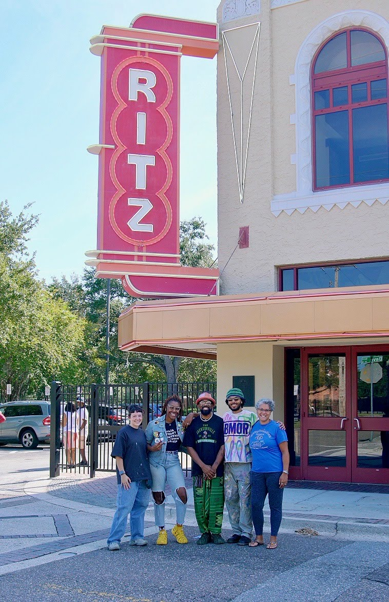

The exhibit was called *Front Porch History: Mapping Undiscovered Stories of Black Jacksonville* and it depicted how our research intersected with visual art. The exhibit was up from August 2025 to January 2026. Because history is not scientific and, therefore, not accurate, we attempted to correct the record on Black history, Black lives, and Black experiences in Jacksonville throughout the 20th century by:

1. Identifying individuals who contributed to the historical and cultural significance of Jacksonville’s Black experience
2. Listening to their stories (going to the source) without interruption or assumption
3. Drafting their narratives alongside the history of the city
4. Displaying previously unshared artifacts that support their stories
5. Including portraits of those we interviewed to further engage visitors

Our goal was centered in radical empathy  in the ways we told these stories that are fading from memory. We wanted to honor their words and memories in a way that would resonate the most with museum visitors, so we displayed their narratives and photographs on posters that were plotted on a map of Jacksonville’s northside and included portraits of those we interviewed. The posters were the “front porch history” and the portraits were part of the Jacksonville Legends Series, painted by Vic Alexander, the visual artist on the team.

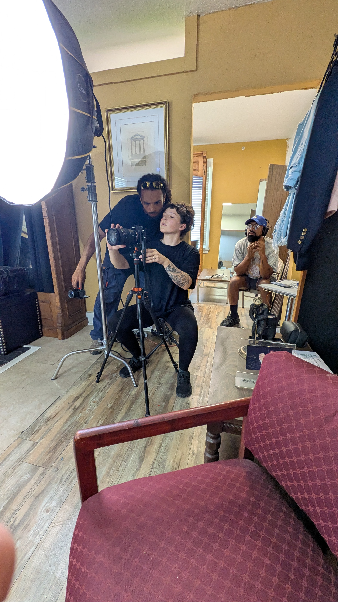

We examined how the accounts of these nine individuals correlated with news articles, books, magazines, and academic research tracing local, state, and U.S. history. We then took those stories from the front porch to public discourse and held an Artist Talk about the people we met, the stories we collected, and the research we performed. We know these stories are more than seemingly unforgettable accounts of Jacksonville’s history; they are American history, worthy of preservation and public appreciation.

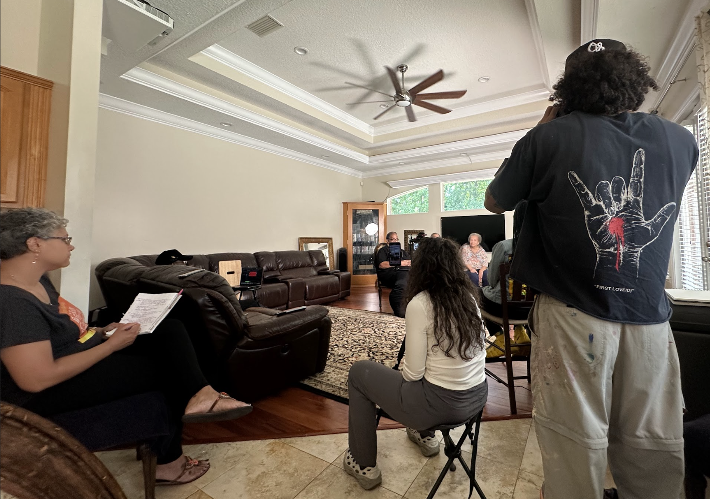

## Resources

Drake, Tracy S., Aisha Connor-Gaten, and Steven D. Booth. “Archiving Black Movements: Shifting Power and Exploring a Community-Centered Approach.” Library and Information Studies and the Mattering of Black Lives, eds. Tonia Sutherland, Michelle Caswell, Safiya Umoja Noble, and Sarah T. Roberts. Special issue, Journal of Critical Library and Information Studies 4, no. 1 (2022). DOI: https://doi.org/10.24242/jclis.v4i1.170.

DuBois, W. E. B. (1935). Black Reconstruction: An Essay Toward a History of the Part whichBlack Folk Played in the Attempt to ReconstructDemocracy in America, 1860–1880. Harcourt, Brace and Company.

# Project

We spent 8 weeks filming interviews with people we identified as “Black Jacksonville,” individuals linked to Black sports, schools, historic neighborhoods, and the Civil Rights Movement. Nine people were selected: Saundra Morene, Patricia Pearson, Rutledge Pearson Jr., Roderick Pearson, Otis “Crazy Boy” Williams, Mariano Mendez Jr., Coach Al Austin, Noelle Barber, and Anita Garner.

While the interviews were designed to document historic people, places, and events in Black Jacksonville, we knew we had to establish the significance of these individuals in their own right and affirm their value to our culture, our city, and our history. These nine individuals were hidden figures who deserved to be moved from the margins of discourse about Jacksonville’s Black history to the center. We discovered that many of their accomplishments had not been documented or publicized in mainstream media and that their names and likenesses were fading from public consciousness.

## Saundra Morene and the Cosmo neighborhood

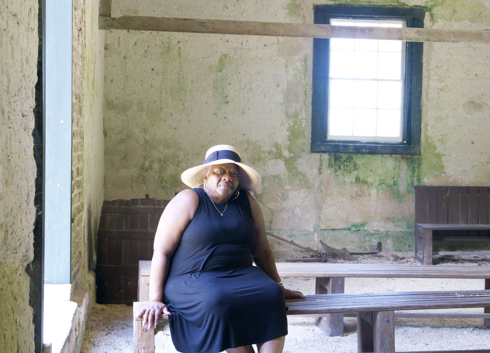

Saundra Morene is a Jacksonville native and Gullah Geechee descendant. She is President of [Jacksonville Gullah Geechee Nation CDC](http://www.gullahgeecheeglobal.com/) and helped to establish the federally-protected Gullah Geechee corridor.

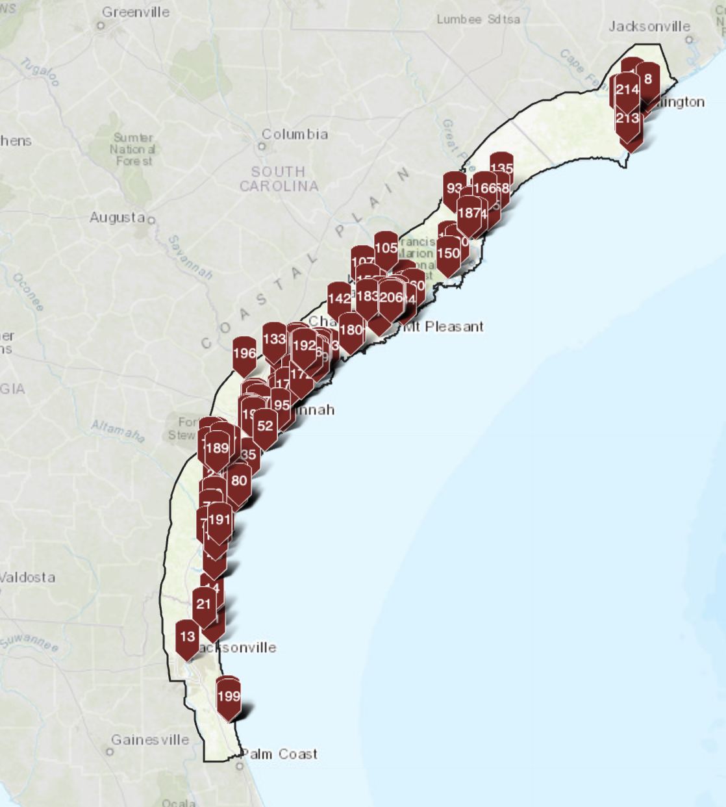

Cosmo was an historic Gullah Geechee neighborhood that was settled after the Civil War. Starting in the late 1950s, residents were pushed out and after Jacksonville Consolidation, the entire area became a popular suburb for white residents.

## Pearson Siblings

Patricia, Rutledge Jr., and Roderick are the children of Civil Rights leader Rutledge Pearson. Pearson led the Jacksonville Branch of the NAACP, was a high school teacher, and mentored the NAACP Youth Council as they exercised nonviolent sit-ins to integrate restaurants and stores in downtown Jacksonville. The most important value he could instill in his children was the importance of education. Patricia saw education as a way to give back was a way to find strength even during the lowest points in a person’s life. All three children went on to incorporate educating others in their careers.

> **“By the time when my father passed, my mother was a librarian for the city of Jacksonville. But when I was growing up, she worked in the employment agency, the State of Florida Employment Agency. Before that, she worked for a female doctor that lived on Arlington, which was, of course, all white. But it was fun. We would go across the bridge and pick her up from work. But they both were workers. There's this attitude that we, as a people, are lazy. At least it was that way in the '50s and '60s. And yet people were here in Jacksonville, people were working all different kinds of jobs. Before my father became a teacher, he worked in the shipyard, and he drove cabs.” -Patricia Pearson**

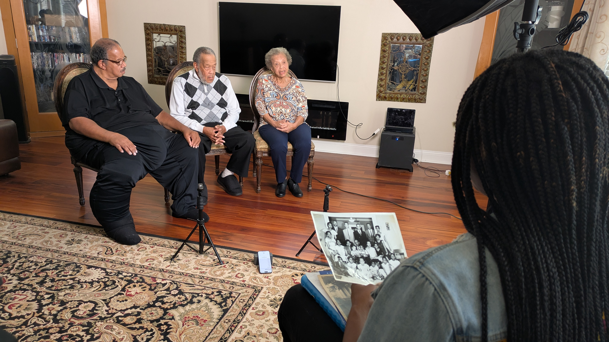

> **“Being a child of a civil rights leader I think all kids that have experienced being kids of civil rights leaders have a certain sensitivity to racial relations between people. They find themselves having to view a situation from both sides of the spectrum of what you're trying to deal with, because you're representing someone that believes in rights for everybody….my father always believed that he was fighting for rights for everybody, whether you're Black, White, or whatever, just to be treated fairly, equally.” -Rutledge Pearson, Jr.**

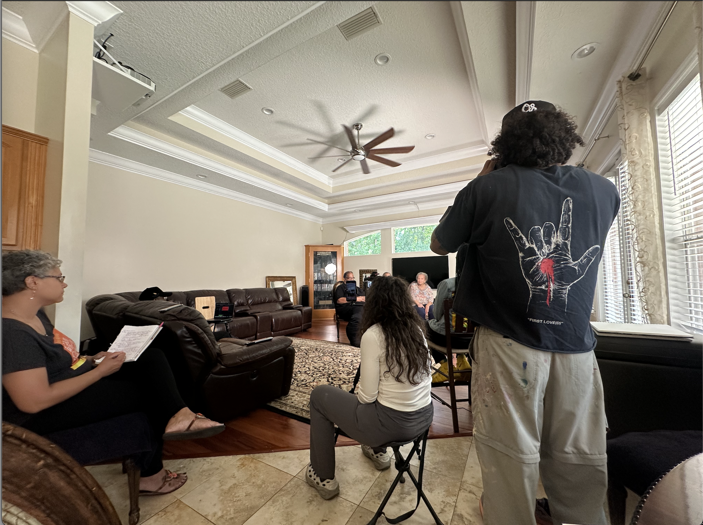

> **“I want to say that's part of what my dad spoke to, in terms of how do you treat people? .... Right now in our society, right now, we're living with certain races being preferred, certain races not being preferred, and people looking the other way when things happen, or they make excuses for the actions of individuals instead of calling out as being wrong. Because right is right and wrong is wrong. Absolutely. There's too many times right now that people are making excuses for behaviors because they don't realize that when you got a finger pointed at somebody else, you got three pointed back at yourself. That's You're next.” -Roderick Pearson**

## Otis “Crazy Boy” Williams

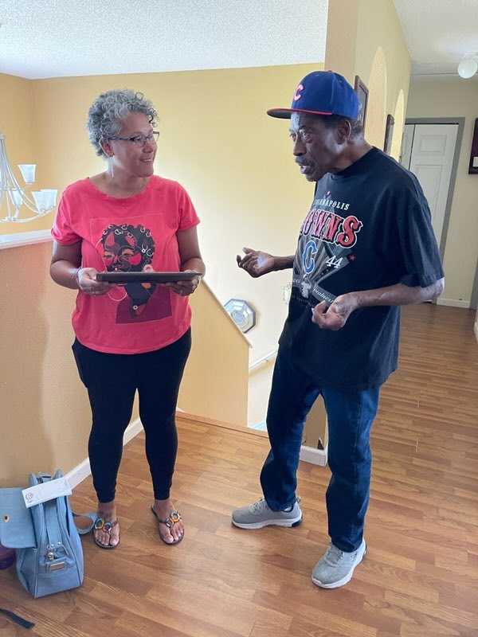

Otis joined the Indianapolis Clowns in 1965 and played with them for three years. When they arrived in town to play a game, they would “kick the mule” by parading down the town’s main street, playing music, marching, and performing antics. This act served as a promo for their upcoming game that afternoon or evening.

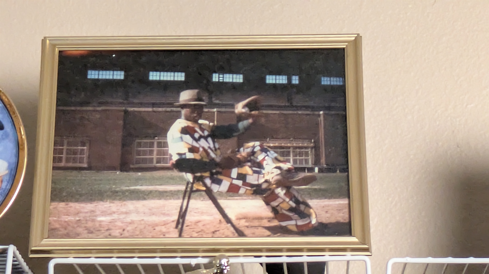

He played first base and sat in a chair holding a huge glove. In one game, the pitcher struck out two hitters and when the third hitter hit the ball, he would pull another one out of his pocket and tag the guy out. The entertainment aspect of the game was very important: it fed the audience who, in turn, fed the players.

## Mariano Mendez Jr. - LaVilla

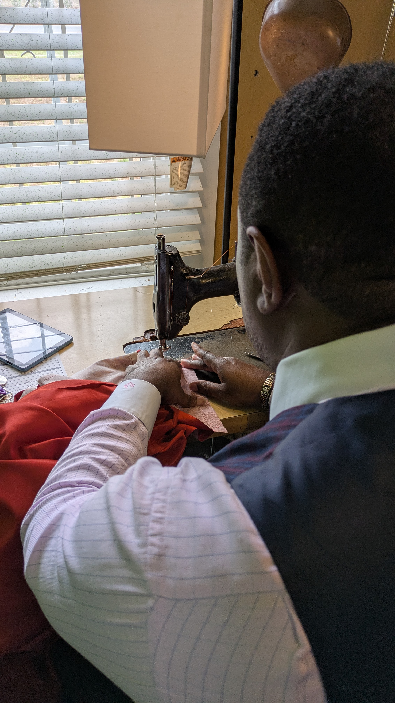

Mariano is a 3rd generation Cuban-Black tailor. His grandfather, Pedro Mendez, moved from Cuba to New York and in 1926 moved to Jacksonville where he opened a tailoring shop in LaVilla. His son, Mariano Sr., opened a shop in 1975 on Beach Blvd. Mariano and his father, Mariano Sr., both became Master Tailors before graduating from high school and while tailoring came easily to him, he originally went into acting. He would tell people on the set that he was a tailor, which helped him establish his expertise. Eventually, the profession chose him. In 2009 he took over the business from his father, working in the same Beach Boulevard shop he opened 50 years ago. Mariano still sews by hand or uses his dad’s old Singers, fixing them himself when something breaks. He refuses to use automated sewing machines; his hand-work is better and allows him to create the delicate and detailed custom clothing that drives his business.

## Coach Al Austin - Outeast

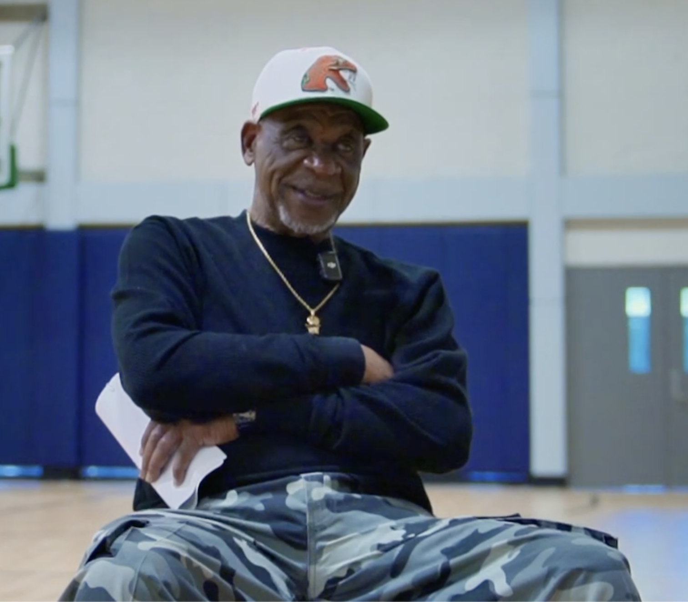

> **If any coach say that they developed, I mean, they made a player, that player is tremendous, boy, because of this coach, the coach is tremendous because of the player. Players have a lot of natural ability. You have to be able to go in there with the mental attitude to try to develop the player. You try to refine those skills…You have to just channel those skills along an organized manner, so to speak, and get them to play team ball rather than part or individual ball. That's where the key come in. Then you have to be able to play defense as a unit and offense as a unit. You're going to get in there and try to develop and improve the skill level, but the talent was there before that. -Al Austin**

## Noelle Barber - Sugar Hill

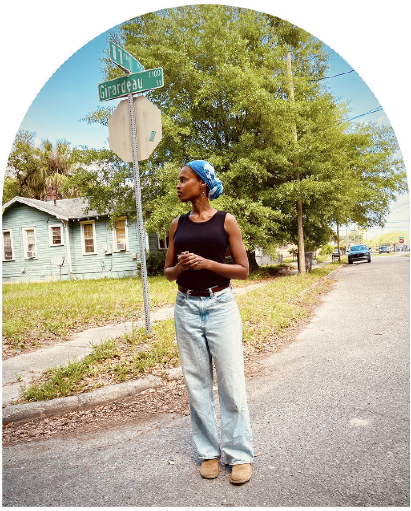

> **It's really incredible to hear the stories and it's not like, even when I think about Papa and Uncle Arnette, like being part of their legacy, but then it's also like this is the legacy of this community in this city in Black Jacksonville…So much is how connected, how small this community of Black Jacksonville is, and how interconnected we are. I can talk to you and find out that your grandfather knew my grandfather and then, like we were all like, really connected and we still have so few degrees of separation, so I feel proud. -Noelle Barber**

## Anita Garner - Sugar Hill

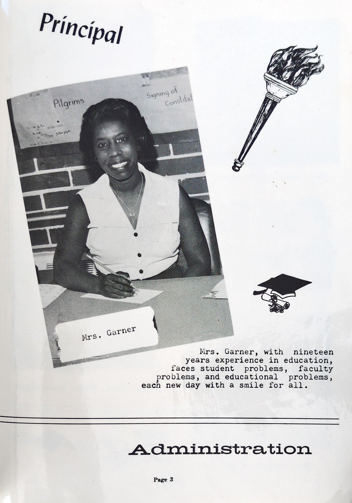

In 1968, Ms. Garner was the first Black female principal of a predominantly white elementary school, Jacksonville Beach Elementary. She helped to integrate the school, which was started by Rhoda Martin, a woman born into slavery who started the school and a church out of her home around 1905. Ms. Garner established Jacksonville Beach Elementary School as the first 6th grade center at the Beaches. In 1983 she transferred to Forest Hills Elementary (now Sallye B. Mathis) to work closer to home.

> **But as now, I just tell people, this too shall pass…if something happens that is not appropriate for that particular time. And as my grandmother said, keep your hand in God's hand. And I've tried to do that. And I've tried every day to do something good for somebody. And of course what you notice, they have the food box and the reading box. All these young people that pass here belong to somebody, so they become mine…[and] they all call me Mama. -Anita Garner**

# Black Jacksonville Collective team bios

## [Kelsi Hasden](https://www.instagram.com/kelsihasden/ "Kelsi's Instagram") - Historian and writer

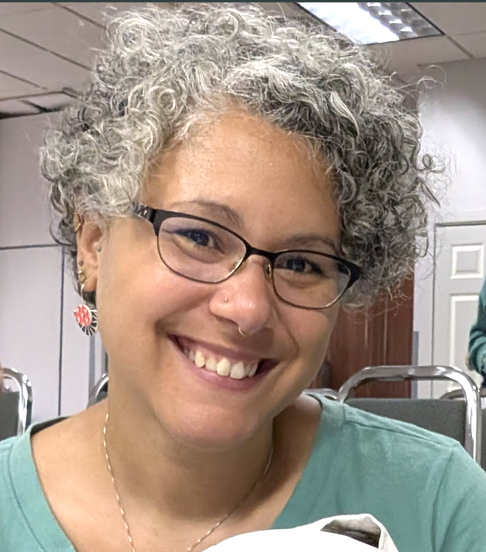

Kelsi has worn many hats in her career; whether teaching composition courses at local colleges or working as a technical writer or content designer, her primary focus has always been the user’s experience.

Her work can be seen on the signs at the Lift Ev’ry Voice and Sing Park and on upcoming Black Heritage Trails in LaVilla. In 2024 Kelsi founded Rooted as a place to showcase her professional work and passion projects, which includes work from the Black Jacksonville Collective.

Major projects Kelsi has contributed to include:

* Advocating for inclusive revitalization in Black historic neighborhoods throughout Florida by researching and crafting their historic narratives
* Collecting oral histories and curating the Front Porch History exhibit at the Ritz in collaboration with the Black Jacksonville Collective
* Writing and editing articles for the hyper-local websites [metrojacksonville.com](http://metrojacksonville.com) and [thejaxson.org](http://thejaxson.org).

She loves reading, petting cats, and, as a true geriatric millennial, embroidering flowers.

## [Dana Maule](https://www.instagram.com/northsidepridejax/ "Northside Pride") - Production Manager, Community Activist, and Writer

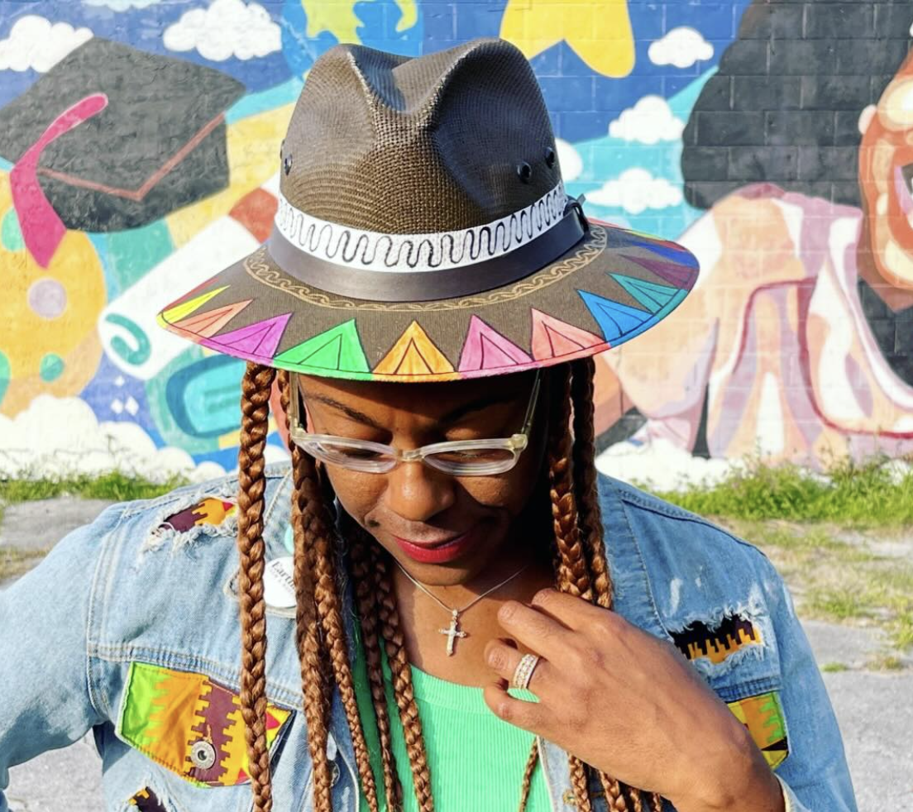

Dana Michelle Maule is a two-time Audience Choice award winner in the Jacksonville 48 Hour Film Project and a recipient of the Ken Knight NABJ Jacksonville award for Storytelling Excellence. Her current project, “Moncrief Springs,” is a travel documentary exploring how tourism in urban areas can protect Black history and preserve Black neighborhoods. In 2025 Dana founded Northside Pride of Jacksonville, a neighbor-led initiative to amplify, promote, and preserve Jacksonville’s Northside neighborhoods and businesses.

A third-generation native of Duval County, Dana is a journalist, artist, activist, and marketing expert with over a decade of experience. She is an Executive Committee member of the Sierra Club of Northeast Florida, a member of the board for Artistic Journey's, a volunteer with St. Johns Riverkeeper and the Durkeeville Steering Committee, certified tourism Ambassador for Visit Jacksonville, and a 2025 graduate of the Placemaking School of Jacksonville. She has dedicated all of her work and achievements to her husband of 19 years and 3 sons.

## [Victor Alexander ](https://www.instagram.com/metamorphvic/ "metamorphvic")- Visual Artist

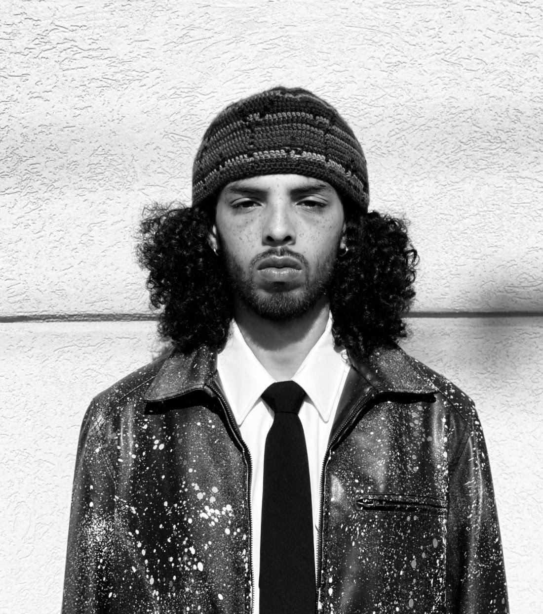

Victor Alexander, known artistically as Metamorphvic, is a Jacksonville-based visual artist whose work explores identity, legacy, and transformation. His practice spans portraiture, illustration, and public art — always rooted in storytelling and cultural reflection.

Through expressive strokes, layered textures, and symbolic forms, Alexander captures the spirit of those often overlooked — from local legends to everyday people who carry quiet power. His art is a bridge between the past and present, honoring the truth that we are shaped by those who came before us.

The name Metamorphvic speaks to his creative philosophy: always evolving, always becoming. With each piece, he invites viewers to look closer — not just at the subject, but at themselves — and to remember that art, like identity, is never static.

## Samantha Alexander – Creative Director and Project Manager

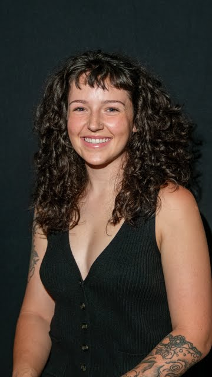

Samantha Alexander is a Jacksonville-based creative director and project manager with a talent for turning vision into structured, actionable plans. She specializes in organizing events, managing brand operations, and supporting artists and small businesses behind the scenes.

With a focus on clear communication and intentional planning, Samantha brings creative projects to life through thoughtful coordination and strategic oversight. Her work supports cultural events, visual branding, and community-focused initiatives throughout Jacksonville and beyond.

## [Larry Wakefield](https://www.instagram.com/iamdjlarrylove/ "DJ Larry Love")  – Cultural Architect, DJ, and Community Catalyst

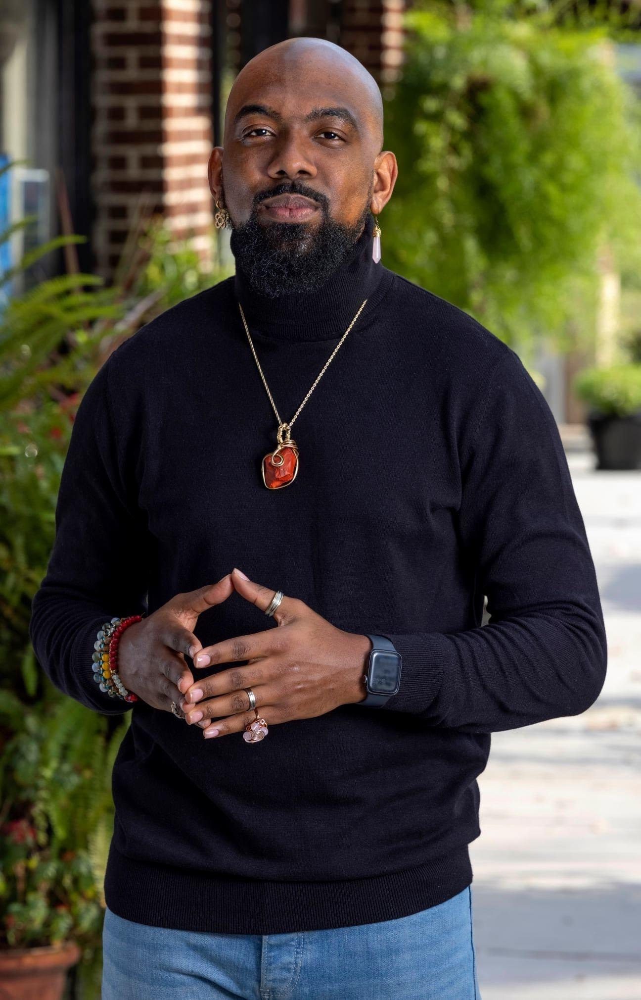

Larry Love is a multidimensional force at the heart of Jacksonville, FL’s creative and cultural resurgence—a DJ, curator, event producer, spiritual leader, and visionary whose work spans art, wellness, music, history, and community empowerment. Born and raised in Jacksonville’s historic Moncrief Neighborhood, Larry’s journey has taken him from serving in the U.S. Air Force to returning home with a mission: to reclaim his city’s narrative and spark a renaissance rooted in love, legacy, and liberation.

Through his creative agency and umbrella brand Love Creates, Larry curates transformative experiences that uplift, educate, and celebrate Black excellence. Whether he’s spinning records, curating festivals, advocating for wellness, or mentoring youth, Larry Love is doing more than creating events—he’s building a blueprint for cultural healing and legacy. His work serves as both a celebration of Jacksonville’s Black brilliance and a call to action for those ready to reshape their city with intention and heart.

# Contact

[**kelsi@berooted.now**](mailto:kelsi@berooted.now)

[**www.berooted.now**](http://www.berooted.now)

# AACAT 1870

The African American Community Archives Theory is based on a conceptual framework that aims to facilitate the archiving process within Black communities. It recognizes the importance of preserving and organizing information in a way that serves the specific needs and interests of these communities.

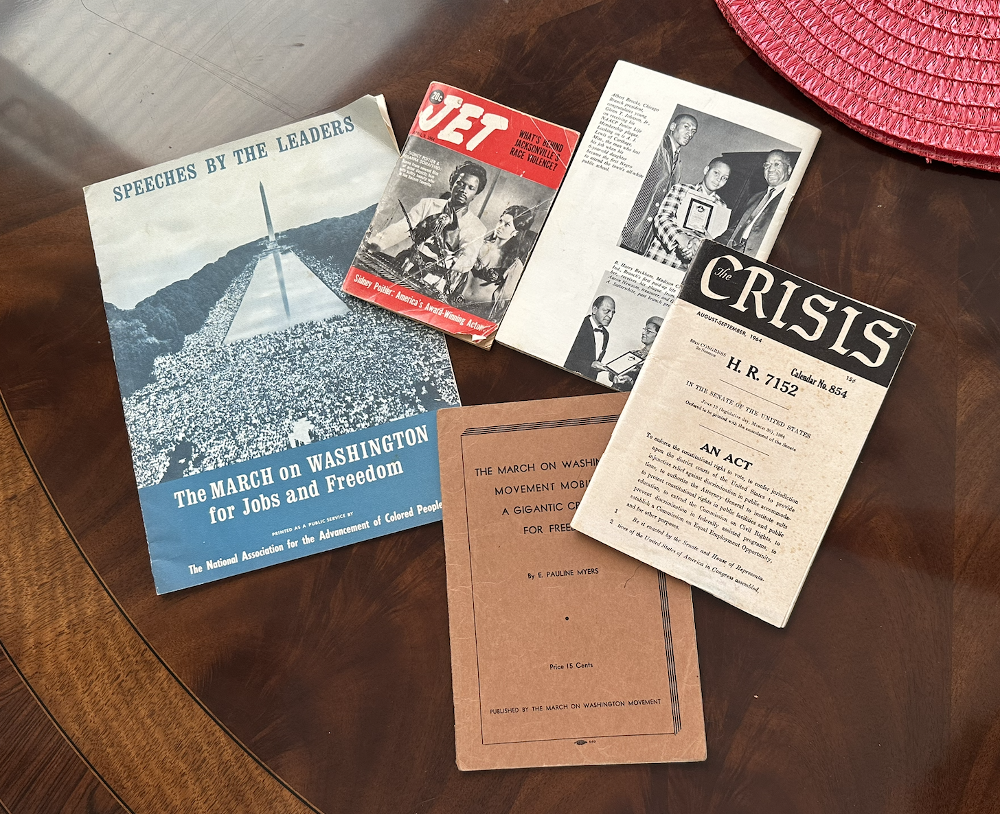

## Principles

**Understanding  the cultural backgrounds and histories of African and African American peoples.**

The Black Jacksonville Collective is a group of Black, biracial, and white individuals who are rooted in Jacksonville’s Black community. Each of us is committed to contributing to the Black community as community organizers, historians, and event organizers. The Collective models the theory by aligning with the principle of respecting the culture and history of the community via the research, interviews, archive, and distribution of the stories.

**Foster community participation through collaborative initiatives.**

Each person we’ve interviewed was identified by way-of-mouth or by attending cultural events. Dana Maule, a community activist and organizer, is embedded within the community we are exploring. It is through her connections that we are able to identify individuals whose stories have not been documented.

**Employ survey methods to obtain valuable information from the local community.**

This principal will form a major area of research for my capstone. It will be crucial to identify ways to obtain feedback from the community to improve the ways in which we engage with the community, tell/distribute the stories, and fact-check our information.

Jacksonville is known as the Harlem of the South, but several of the individuals who started the Harlem Renaissance were from Jacksonville’s LaVilla neighborhood. James Weldon and J. Rosamond Johnson grew up in LaVilla and Zora Neale Hurston spent many years there. While we touch on these stories, the purpose for the Collective is to share the stories that are only known within tight-knit communities; stories that are passed down orally and not published anywhere. The theory guides my capstone by emphasizing the importance of input from the community. I would like to identify productive ways to request and incorporate feedback from the community and ways to increase community participation.
